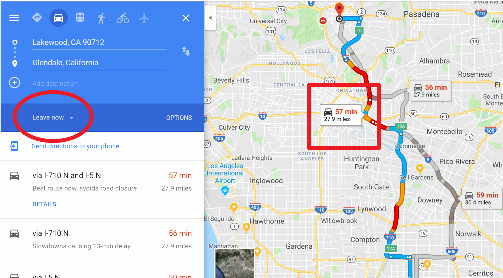
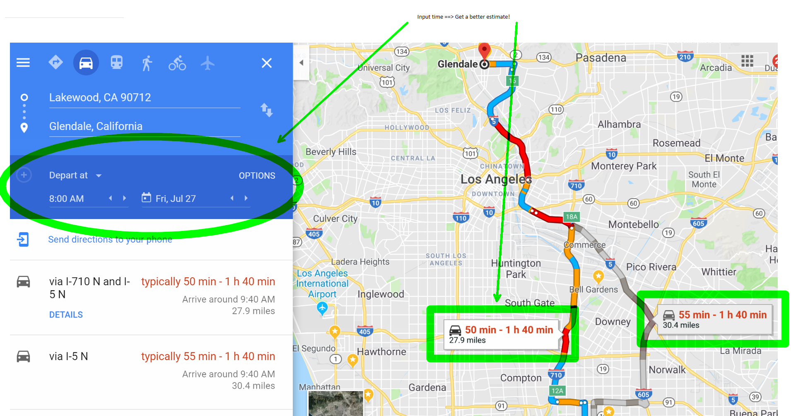
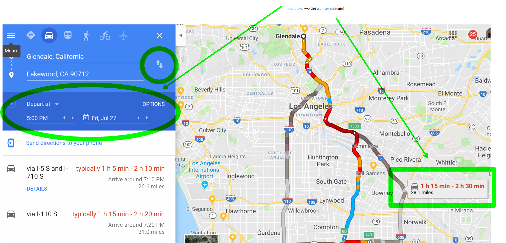

# Steps for calculating an accurate commute time

Directions for anyone looking to ACCURATELY estimate a commute time for a new potential job, whether its for yourself, or someone else.

### Estimating Commute Time

Launch https://www.google.com/maps/dir/Lakewood,+California/Glendale,+CA/@33.9984062,-118.3153108,11z/data=!3m1!4b1!4m18!4m17!1m5!1m1!1s0x80dd325fe4a8811d:0xc75ba86029c978c5!2m2!1d-118.1339563!2d33.8536269!1m5!1m1!1s0x80c2c032c8f083a9:0xe53fa19efec926a6!2m2!1d-118.255075!2d34.1425078!2m3!6e0!7e2!8j1532678400!3e0


Enter **STARTING POINT** location  
Enter **DESTINATION** location  
Expand **Depart at** dropdown. *this is important folks! IF YOU DONT DO THIS, SHAME ON YOU!*  
Enter **MORNING TIME**  
```
NOTE: If you do not input DEPART AT for a realistic time in the future, the calculation will NOT BE ACCURATE. 
```

### Bad Calculation (*AVOID THIS! IF YOUR DOING THIS, SHAME ON YOU!*)



### Good Calculation TO destination



### Good Calculation FROM destination

```
NOTE: You must Reverse starting point and Destination and Enter EVENING TIME
```




```
NOTICE HOW THE ABOVE METHOD NEARLY DOUBLES THE ESTIMATE OF THE COMMUTE! 
```


